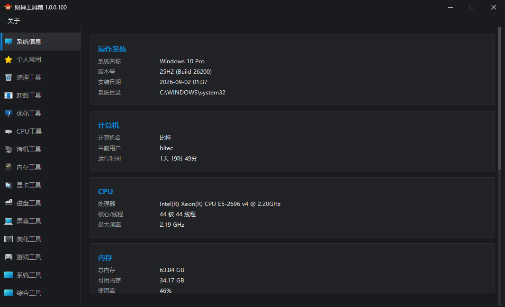

# 财神工具箱 (CsToolBox)

一款面向硬件爱好者与系统维护人员的 Windows 桌面工具箱软件，内置 CPU、内存、显卡、磁盘、系统、卸载、优化、清理等 12 大分类、数十款常用工具的快捷启动入口，统一界面、一键调用，省去到处找工具的麻烦。

## 功能概览

- **统一启动台**：所有工具按分类陈列在侧边栏，点击即用，无需记忆路径
- **在线图标获取**：自动从服务器拉取工具图标，界面不枯燥
- **自定义工具**：支持用户自行添加 `.csurl` 快捷方式（JSON 格式，含 `url` 和可选 `icon` 字段）
- **暗色主题**：整体深色配色，长时间使用不刺眼
- **便携运行**：绿色软件，不写注册表，解压即用

## 截图



## 下载安装

- 官网下载中心：<https://wincstool.cn/download.html>
- 下载安装包后双击运行，按向导完成安装即可
- 也可选择绿色版，解压后直接运行 `财神工具箱.exe`

## 从源码编译

### 环境要求

- Windows 10 / 11 x64
- Visual Studio 2022（含 C++ 桌面开发工作负载）
- Windows SDK 10.0

### 编译步骤

```bash
# 克隆仓库
git clone https://github.com/GetcsTool/wincsToolBox.git
cd wincsToolBox

# 用 Visual Studio 打开 src/财神科技.slnx，选择 Release x64，生成解决方案
# 或命令行编译：
msbuild src/财神科技.vcxproj /p:Configuration=Release /p:Platform=x64
```

编译产物输出到 `src/x64/Release/` 目录。

### 生成安装包

```bash
# 需要安装 Inno Setup 6
ISCC installer/installer.iss
```

## 目录结构

```
wincsToolBox/
├── .gitignore
├── README.md
├── installer/
│   └── installer.iss          # Inno Setup 安装脚本
├── scripts/
│   └── screenshot.ps1         # 截图辅助脚本
└── src/
    ├── icons/                 # 分类图标 (PNG)
    ├── 财神科技.cpp           # 主源文件
    ├── 财神科技.h             # 主头文件
    ├── 财神科技.rc            # 资源文件
    ├── 财神科技.ico           # 应用图标
    ├── 财神科技.slnx          # VS 解决方案
    ├── 财神科技.vcxproj       # VS 项目文件
    ├── 财神科技.vcxproj.filters
    ├── Resource.h             # 资源头文件
    ├── framework.h            # 框架头文件
    ├── targetver.h            # 目标版本定义
    ├── app.manifest           # 应用清单
    └── small.ico             # 小图标
```

## 工具数据说明

`data/` 目录存放各分类下的第三方工具可执行文件，这些工具版权归属各自原作者，**不纳入本仓库版本控制**。首次运行程序时会提示获取工具数据包。

## 相关链接

- 官网：<https://wincstool.cn>
- 下载中心：<https://wincstool.cn/download.html>
- 更新历史：<https://wincstool.cn/changelog.html>
- GitHub 仓库：<https://github.com/GetcsTool/wincsToolBox>

## 免责声明

本软件仅为工具快捷启动器，不修改、不重新分发所包含的第三方工具。所有第三方工具的版权归原作者所有，用户使用时需遵守相应工具的许可协议。本软件不对第三方工具的使用行为承担责任。